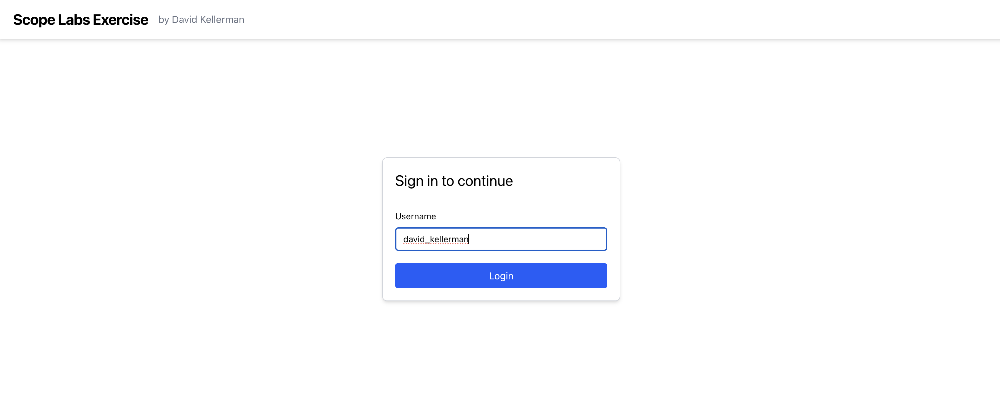
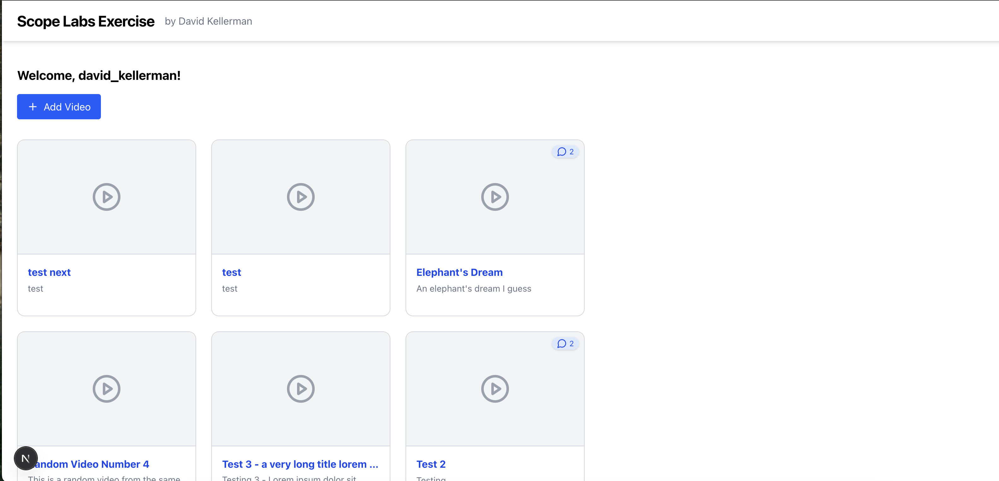
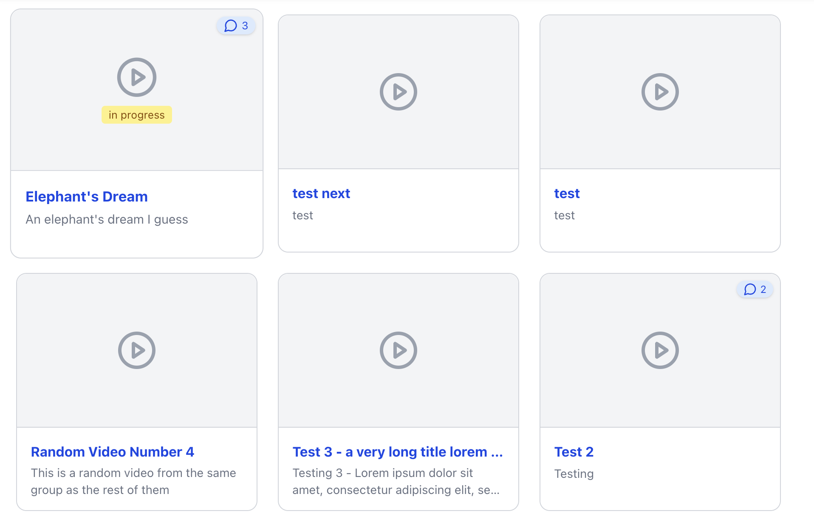
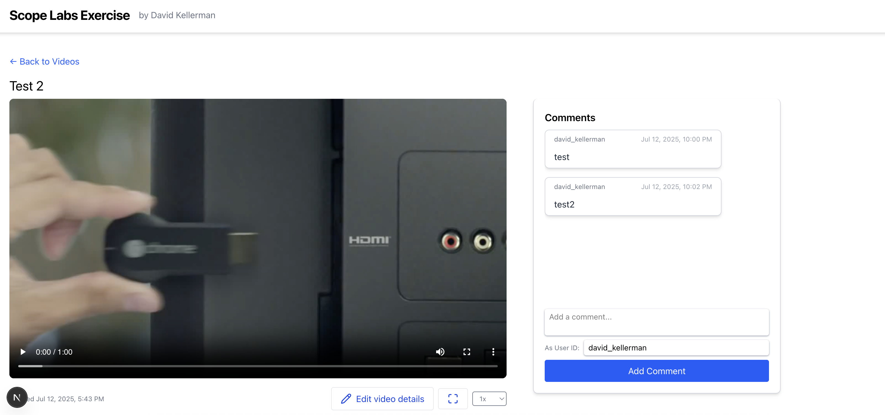
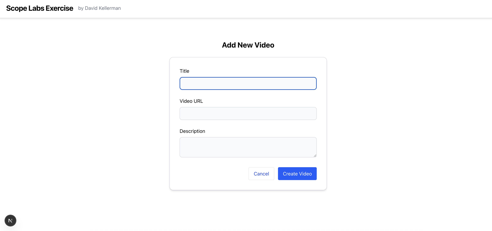
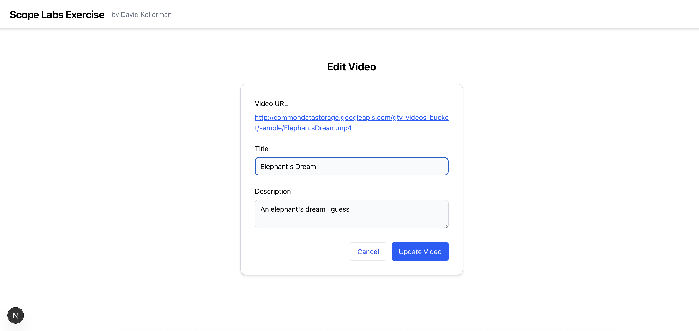

# David Kellerman - Scope Labs Example

## Overview

A web application for managing and viewing videos. Built with Next.js and Tailwind v4. UI works on both mobile web and desktop.

### Features

- Splash page: fake login by entering any username on the home page (saved in sessionStorage)
- User videos list
  - Videos marked as in progress (when played), and are sorted first for easy access - stored in localStorage
  - Otherwise videos sorted by creation date (updated date might be ideal)
- Video details and HTML5 player
  - Also added custom fullscreen/speed buttons to demo custom controls
  - Allows anonymous users to view video details and comment - not sure if this was intended to be public, but would be a quick change to remove
- Comments
  - For now username can be entered along with comment
- Add new video
- Also included an "edit video" since I was unsure if that was required

## Getting Started

### Prerequisites

- Node.js / npm

### Installation

```bash
npm install
```

### Running the Application

```bash
npm run dev
```

Then open [http://localhost:3000](http://localhost:3000) in your browser.

## Project structure

```text
.
├── public/
│   └── screenshots/         # App screenshots for README
├── src/
│   ├── app/
│   │   ├── layout.tsx       # Root layout
│   │   ├── page.tsx         # Home/login page
│   │   ├── globals.css      # Global styles
│   │   └── videos/
│   │       ├── layout.tsx   # Common layout for logged in pages
│   │       ├── page.tsx     # Video list page
│   │       ├── new/
│   │       │   └── page.tsx # Add new video
│   │       └── [id]/
│   │           ├── page.tsx # Video detail
│   │           └── edit/
│   │               └── page.tsx # Edit video
│   ├── components/          # Reusable UI components
│   │   ├── CommentsList.tsx # Comments bar and new comment form
│   │   ├── LogoutLink.tsx   # Fake logout
│   │   ├── VideoDetail.tsx  # Video details and player
│   │   ├── VideoForm.tsx    # Common form for add/edit video
│   │   ├── VideosContext.tsx# State and API calls
│   │   ├── VideosList.tsx   # Main videos grid
│   │   └── ui.tsx           # Common components (shadcn-like)
│   ├── constants.ts         # App constants, include API endpoint
│   └── types.ts             # Shared TypeScript types
├── package.json
├── tsconfig.json
└── ... (config files)
```

## Screenshots

<!-- Replace these with actual screenshots -->







## Future ideas and current limitations

- Auth is mostly fake and not well tested, would typically make an AuthContext wrapper for this, but wanted to keep the code minimal
- Pagination would be needed, but requires server-side sorting
- plyr-react might be a better option than HTML5 video with custom controls
- UI assumes that video thumbnails would eventually be provided, at same aspect ratio as video
- I think getting the exact right responsive grid layout for the video list (keeping the thumbnail aspect ratio intact) would require some more thought and testing
- Could use more form validation on the client-side, especially the video URL
- Timestamps could use a library like time-ago
- Avoided server-side fetch for simplicity, but it might make the app snappier
- Comments and descriptions will not allow HTML or markdown, and are not sanitized (but are auto-escaped)
  - rich text would benefit from CSP policy
- I slightly regret putting the comments on the right side, I think below the video would have been a cleaner option, without any scrolling
- Comments don't update in real-time (could use websocket, poll, or SSE)
- Comments would benefit from a nicely implemented "optimistic" add
- Some loading states are causing a little bit of flicker (SSR would help with that)
- Truncation of title/description could be an issue on mobile, since there's no hover to see complete text
- A newly added video ought to be sorted first in the list, ahead of the in progress videos, and probably have some kind of visual indicator
- I don't love the placement of the add button
- Invalid video detail ID throws 500 on the server, might be nicer to respond with 404 - hence it shows a generic error rather than a "not found" on the UI
- Making playback rate sticky could be a nice feature when returning to the same video often
- Percentage progress of video would be nice as well
